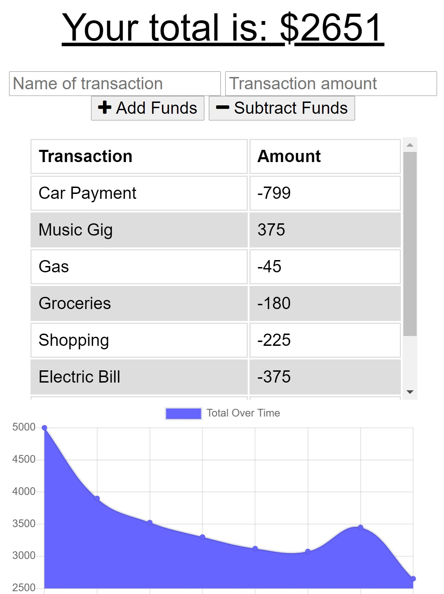

# Budget Tracker
A budget tracker app that allows the user to add expenses and make deposits while giving the user a money balance.  The app is available offline and will still have full functionality.

[Check out the Budget Tracker Here](https://budgeting-tool-pwa.herokuapp.com/)

# Description
    AS AN avid traveler
    I WANT to be able to track my withdrawals and deposits with or without a data/internet connection
    SO THAT my account balance is accurate when I am traveling 

    GIVEN a budget tracker without an internet connection
    WHEN the user inputs an expense or deposit
    THEN they will receive a notification that they have added an expense or deposit
    WHEN the user reestablishes an internet connection
    THEN the deposits or expenses added while they were offline are added to their transaction history and their totals are updated

# Tools
[IndexedDB]()

[NoSQL]()

[Express.js]()

[MongoDB]()

[Mongoose]()

[Heroku]()

# Credits
[DeAnna Martinez](https://github.com/deannapi)